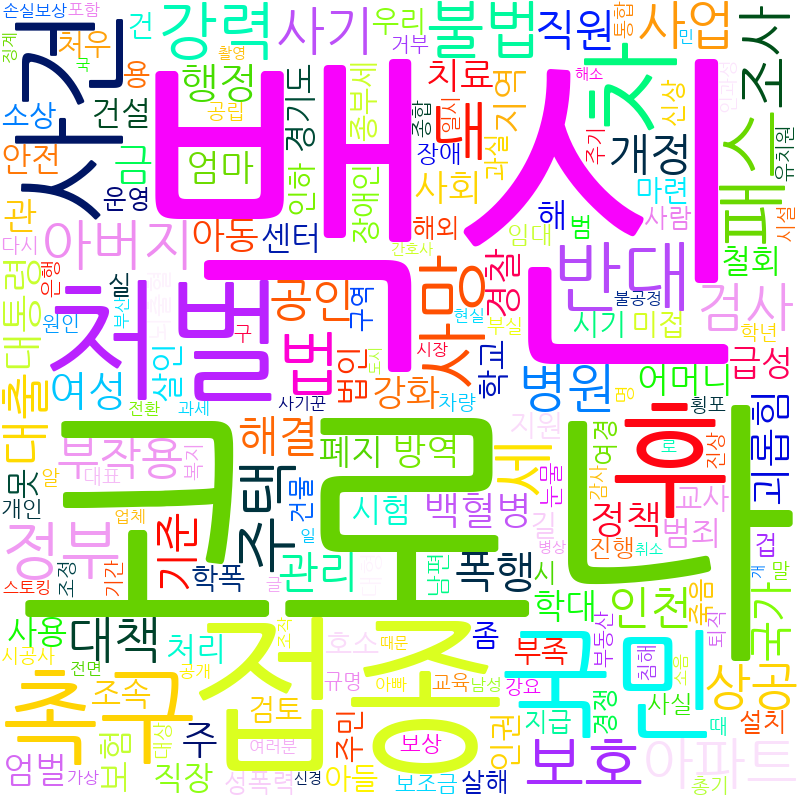

# 2021-1 빅데이터 자료분석 웹 크롤링 과제

## 토픽 선정
청와대 청원 게시글은 어떤 요청이 많을까?

## 방법
1. [청와대 청원 게시판](https://www1.president.go.kr/petitions/?c=0&only=1)의 게시글들을 크롤링 [관련 코드](./src/scrapping.ipynb)   
    총 571개의 게시글
2. 게시글의 제목을 토크나이징 [관련 코드](./src/tokenize.ipynb)
3. 토큰화된 단어들을 가지고 워드 클라우드 [관련 코드](./src/word_cloud.ipynb)

**크롤링한 변수**
|이름|설명|
|---|--|
|번호|게시글의 고유 번호|
|분류|게시글의 카테고리|
|제목|게시글의 제목|
|만료일|청원 만료일|
|참여인원|청원에 동의한 사람의 수|

## 워드 클라우드 결과

